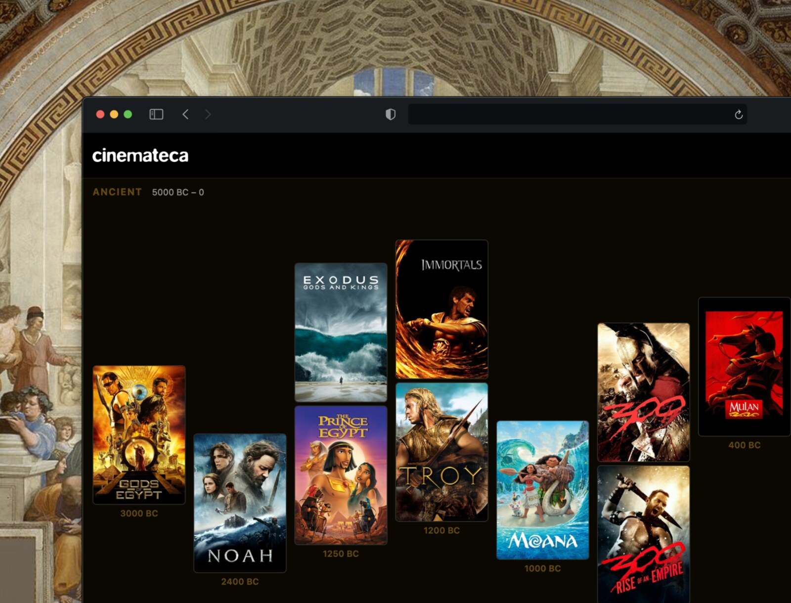

<h1>Timeline</h1>

<p>A small Cinemateca experiment for seeing when movies are set.<br>
Ancient history, recent memory, imaginary futures, all on the same line.</p>

<p>
  
  
  
  
</p>

<p><a href="https://timeline-vercel-sigma.vercel.app">Live site</a> · <a href="https://cinemateca.co">Cinemateca</a></p>



A friend once told me, did you know that The Matrix and Starship Troopers are set around the same year?

That got me thinking. What other movies are set around the same time? After a weekend of playing with timeline interfaces and researching when different movies are set, I ended up with this.

The timeline has 506 films across 13 eras, from 3000 BC (`Gods of Egypt`) to year 4004 (`Return of the Jedi`).

The page is just HTML, CSS, JavaScript, JSON-shaped data, and poster files. There is no database, auth layer, build pipeline, or private data at runtime.

You can drag through eras, zoom poster sizes, and hover a film to see its release year, directors, genres, rating, source, and confidence.

## What can you do with this?

Besides playing around and noticing that Aladdin and Spartacus are set surprisingly close to each other, you could use this repo, or a similar UI, for other timeline projects:

- A music timeline showing albums by recording year, not release year.
- A design history timeline with products, interfaces, and visual references.
- A personal media diary that shows when stories are set, not when you watched them.
- A city timeline with buildings, events, neighborhoods, and lost places.
- A technology timeline that puts devices, protocols, software, and standards together.
- A literature timeline showing when novels are set across real and imagined history.
- A family archive where photos, letters, places, and recordings sit on one line.

## Run locally

```bash
python3 -m http.server 8000
```

Open `http://localhost:8000`.

No install step is required.

## Data and posters

`timeline-data.js` is generated from Cinemateca's local `timeline_films` SQLite table and assigned to `window.TIMELINE_FILMS`.

After changing `timeline-data.js`, download any missing posters:

```bash
node scripts/download-posters.js
```

The script reads each film's `posterPath` and saves the matching TMDB `w342` poster as `assets/posters/<tmdbId>.jpg`.

## Notes

This repository includes movie metadata and poster images from TMDB. This product uses the TMDB API but is not endorsed or certified by TMDB.

Code is released under [MIT](LICENSE). Movie posters, movie metadata, third-party logos, and third-party marks are not covered by that license.

Made by [santiagoalonso.com](https://santiagoalonso.com)
